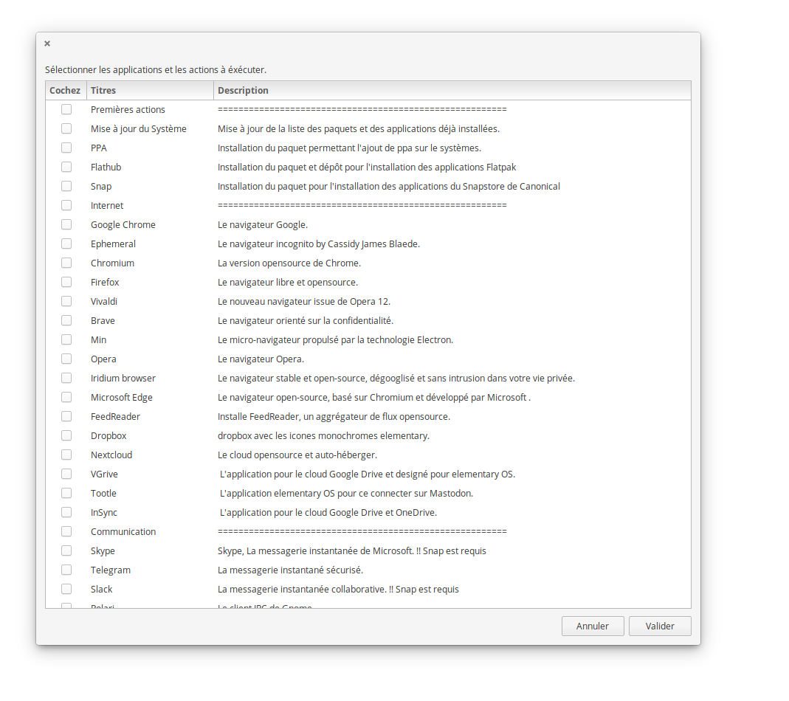

# Script Post Installation pour elementary OS 5.0 Juno

Ce script permet l'installation grouper de nombreuses applications tierces juste après une installation
d'elementary OS 5.0 Juno.



## Utilisation

Télécharger le script, extraire les fichiers et lancer dans un terminal la commande suivante : 
```bash
./elementary_juno-postinstall.sh
```

## Source
Script largement inspiré par celui ci:
https://github.com/ylrxeidx/elementary-script
https://github.com/btd1337/elementary-script
https://github.com/Devil505/elementaryos-postinstall
