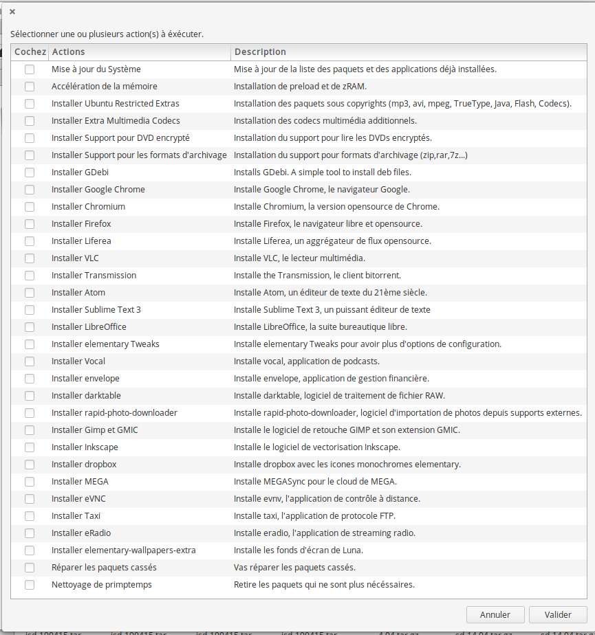

# Script Post Installation pour elementary OS 0.3 Freya et 0.4 Loki (beta)

Ce script a pour but de rendre facile l'installation d'application tierce juste après une installation
d'elementary OS 0.3 Freya ou 0.4 Loki Beta.



## Utilisation

Copiez ceci dans votre terminal

```bash
wget -O /tmp/elementary_freya-postinstall.sh https://raw.githubusercontent.com/Devil505/elementaryos-postinstall/master/elementary_freya-postinstall.sh && chmod +x /tmp/elementary_freya-postinstall.sh && /tmp/elementary_freya-postinstall.sh
``` 

Pour 0.4 Loki beta:

```bash
sudo apt -y install software-properties-common python-software-properties && wget -O /tmp/elementary_loki-postinstall.sh https://raw.githubusercontent.com/Devil505/elementaryos-postinstall/master/elementary_loki-postinstall.sh && chmod +x /tmp/elementary_loki-postinstall.sh && /tmp/elementary_loki-postinstall.sh
``` 

## Source
Script largement inspiré par celui ci:
https://github.com/ylrxeidx/elementary-script
